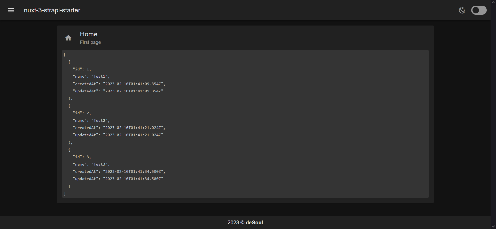
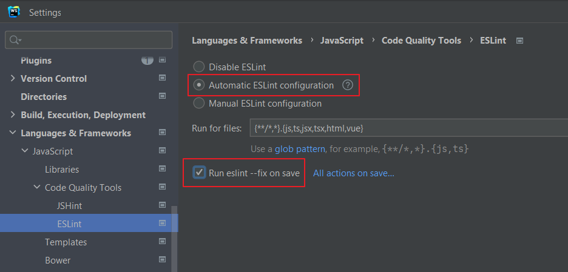

> Проект представляет из себя стартовый набор для разворачивания full-stack приложения на базе фронтенда: Nuxt 3 + Vuetify 3 и бэкенда Strapi 4. Фронтент и бекенд можно запускать по отдельности или вместе, используя оберточный проект, расположенный в корне. 

# Быстрый старт

1. Склонируйте репозиторий
2. Установите зависимости командой `npm install` в директориях проектов: `./`, `./backend/`, `./frontend`
3. Запустите full-stack приложение `npm run develop`

# Инструкция

> Вы можете повторить создание проектов самостоятельно. Данная инструкция позволит выполнить все шаги для реализации данного full-stack приложения.

## Создание главного проекта

Создать `package.json` с текстом:

```json
{
  "name": "nuxt3-strapi-starter",
  "version": "1.0.0",
  "scripts": {
    "develop:backend": "npm run --prefix backend develop",
    "develop:frontend": "wait-on http://localhost:1337/admin && npm run --prefix frontend dev",
    "develop": "cross-env FORCE_COLOR=1 npm-run-all -l -p develop:*"
  },
  "dependencies": {
  }
}
```

Установка зависимостей

- `npm install cross-env`
- `npm install wait-on`
- `npm install npm-run-all`

## Установка Nuxt 3

> Выполняется из директории главного проекта

1. `npx nuxi init frontend`
2. `cd frontend`
3. `npm install`
4. Переименовываем `nuxt.config.ts` в `nuxt.config.js` 

## Установка Strapi

> Выполняется из директории главного проекта

1. `npx create-strapi-app@latest backend --quickstart`
2. После установки заходим в админку и создаем тестовую коллекцию Test
3. Заполняем ее тестовыми данными
4. Даем коллекции Test права на публичное `find`, `findOne`

## Установка модуля NuxtStrapi

> Выполняется из директории проекта frontend

1. `npm install @nuxtjs/strapi --save-dev`
2. В конфигурационный файл Nuxt `nuxt.config.js` добавляются настройки:
```javascript
  export default {  
    modules: ['@nuxtjs/strapi'],  
    strapi: {  
        url: process.env.STRAPI_URL || 'http://127.0.0.1:1337',  
        prefix: '/api',  
        version: 'v4',  
        cookie: {},  
        cookieName: 'strapi_jwt'
    }
}
```

## Проверка извлечения данных Nuxt из Strapi

> Выполняется из директории проекта frontend

Правим `app.vue`, приводим его к следующему виду:

```vue
<template>
  <div>
    <pre>
      {{response}}
    </pre>
  </div>
</template>

<script setup>
  const { find } = useStrapi()
  const response = await find('tests')
</script>
```

На главной появится содержимое коллекции Test

## Подключение ESLint и Prettier к Nuxt

> Выполняется из директории проекта frontend

Устанавливаем необходимые модули

`npm install eslint @typescript-eslint/eslint-plugin @typescript-eslint/parser @vue/eslint-config-standard eslint-config-prettier eslint-plugin-prettier eslint-plugin-nuxt eslint-plugin-vue --save-dev`

Создаем файл `.eslintrc.js`

```javascript
module.exports = {
    root: true,
    env: {
        browser: true,
        node: true,
    },
    parserOptions: {
        ecmaVersion: 2020,
        sourceType: "module",
        parser: "@typescript-eslint/parser",
    },
    extends: [
        "plugin:@typescript-eslint/recommended",
        "plugin:nuxt/recommended",
        "plugin:vue/vue3-recommended",
        "plugin:prettier/recommended",
    ],
    plugins: ["@typescript-eslint"],
    rules: {
        "vue/multi-word-component-names": "off",
        "no-unused-vars": "warn",
        "space-in-parens": "off",
        "computed-property-spacing": "off",
    },
};
```
Включаем автофиксинг кода при сохранении в WebStorm в настройках проекта (`Ctrl + Alt + S`)



## Подключение Vuetify к Nuxt 3

> Выполняется из директории проекта frontend

Установка Vuetify и его компонентов

- `npm install vuetify@next @mdi/font sass`

Создаем плагин `vuetify.js` в `plugins`. Если директории `plugins`, ее нужно создать.
Заполняем `vuetify.js` содержимым:

```javascript
import { createVuetify } from "vuetify";
import * as components from "vuetify/components";
import * as directives from "vuetify/directives";

export default defineNuxtPlugin((nuxtApp) => {
    const vuetify = createVuetify({
        ssr: true,
        theme: {
            defaultTheme: "dark",
        },
        components,
        directives,
    });
    nuxtApp.vueApp.use(vuetify);
});
```

Добавляем в конфигурацию `nuxt.conig.js` код для работы с Vuetify

```javascript
css: [
    "vuetify/lib/styles/main.sass",
    "@mdi/font/css/materialdesignicons.min.css",
], 
build: {
    transpile: ["vuetify"],
},
vite: {
    define: {
        "process.env.DEBUG": false,
    },
},
```

Теперь компоненты Vuetify можно использовать в Nuxt 3 

## Включение шаблонизатора Nuxt 3

> Выполняется из директории проекта frontend

Включение шаблонизатора позволит разделить структуру приложения Nuxt на общий шаблон (`layout`) и страницы (`pages`). Это общая практика создания приложений. 
Для включения шаблонизатора следует отказаться от точки входа приложения через `App.vue`, поэтому удаляем его.

Создаем директории `layouts` и `pages`. В `layouts` создаем `default.vue` с содержимым:

```vue
<template>
  <v-app>
    <v-app-bar>
      <v-app-bar-nav-icon variant="text" @click.stop="drawer = !drawer" />
      <v-toolbar-title>
        <nuxt-link to="/" style="text-decoration: none; color: inherit">
          nuxt3-strapi-starter
        </nuxt-link>
      </v-toolbar-title>
      <v-spacer />
      <v-toolbar-items>
        <v-switch
          inset
          class="pr-3 pt-1"
          :prepend-icon="
            theme.name.value === 'dark'
              ? 'mdi-weather-night'
              : 'mdi-weather-sunny'
          "
          @click="toggleTheme"
        >
        </v-switch>
      </v-toolbar-items>
    </v-app-bar>
    <v-navigation-drawer v-model="drawer" temporary>
      <v-list nav>
        <v-list-item
          v-for="(item, index) in items"
          :key="index"
          :title="item.title"
          :to="item.to"
          :prepend-icon="item.icon"
        />
      </v-list>
    </v-navigation-drawer>
    <v-main>
      <slot />
    </v-main>
    <v-footer app absolute>
      <v-row justify="center" no-gutters>
        <v-col class="text-center" cols="12">
          {{ new Date().getFullYear() }} &copy; <strong>deSoul</strong>
        </v-col>
      </v-row>
    </v-footer>
  </v-app>
</template>

<script setup>
/* imports */
import { useTheme } from "vuetify";
/* data */
const drawer = ref(false);
const items = [
  {
    icon: "mdi-home",
    title: "Home",
    to: "/",
  },
  {
    icon: "mdi-book-open-page-variant",
    title: "Test",
    to: "/test",
  },
];
const theme = useTheme();
/* methods */
const toggleTheme = () => {
  theme.global.name.value = theme.global.current.value.dark ? "light" : "dark";
};
</script>
```

В `pages` создаем страницу`index.vue` с содержимым:

```vue
<template>
  <v-container>
    <v-card prepend-icon="mdi-home">
      <template #title>
        Home
        <v-card-subtitle>First page</v-card-subtitle>
      </template>
      <v-card-text>
        <v-code>
          <pre>{{ response }}</pre>
        </v-code>
      </v-card-text>
    </v-card>
  </v-container>
</template>

<script setup>
const { find } = useStrapi();
const { data } = await find("tests");
const response = computed(() =>
    data.map((r) => ({ id: r.id, ...r.attributes }))
);
</script>
```

И страницу `test.vue` с содержимым:

```vue
<template>
  <v-container>
    <v-card prepend-icon="mdi-book-open-page-variant">
      <template #title>
        Test
        <v-card-subtitle>Second page</v-card-subtitle>
      </template>
      <v-card-text> Some test content </v-card-text>
    </v-card>
  </v-container>
</template>

<script setup>
console.log("Test page loaded");
</script>
```

## Полезные ссылки

https://itnext.io/nuxt-3-first-steps-c23d142405c4
